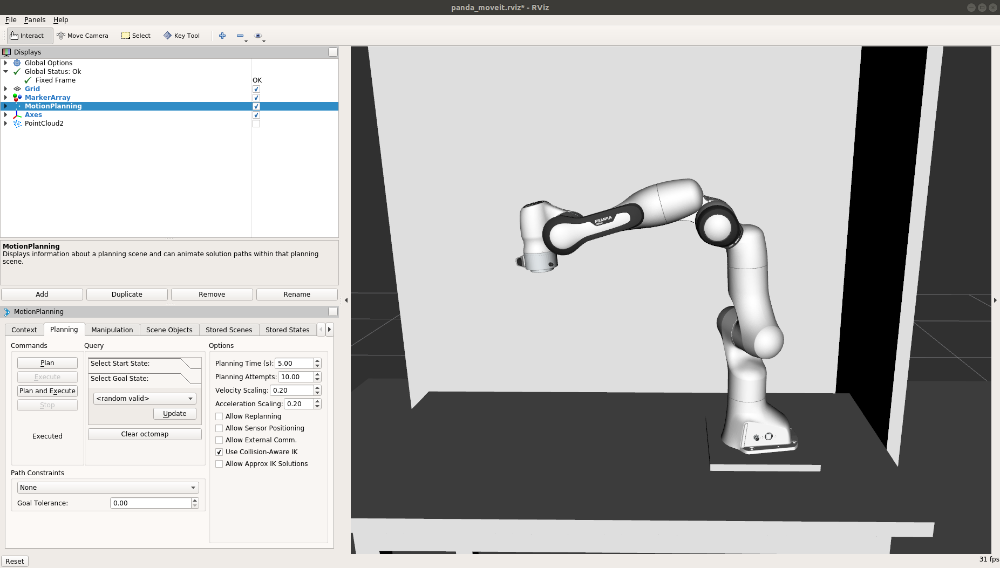

# Integrate a robot using MoveIt!
This page contains all information required to integrate a robot using a MoveIt! configuration package. Examples will be provided using the Franka Panda arm and gripper.

## Must have list
To follow this tutorial, make sure you have the following components:
- MoveIt! configuration package of the robot
- URDF file of the robot
- ROS controllers

## Before starting the framework
1. Open a new terminal (ctrl+shift+t), and clone the MoveIt! configuration package of the robot in `/home/user/projects/shadow_robot/base/src`
2. Run `cd projects/shadow_robot/base/; catkin_make; source devel/setup.bash`

## Tutorial
1. Start the framework: `roslaunch modular_framework_api start_framework.launch`
2. Specify the URDF file of the robot to the framework
3. Set the composition of your robots (how many arms, hands, sensors)
4. Specify the MoveIt config package to the corresponding field in the GUI. You should now see two editors allowing you to provide further options regarding MoveIt! if you need to.

5. In each robot hardware tab that is enabled and that you want to control with MoveIt!, set the corresponding ROS controllers.
6. Create (or load) a new motion planner for the robot you want to integrate. Once the file is initialized in the editor, click one the + to add a new motion planner config.

At this point you should see the `Launch robot` button being enabled. If you don't have anything else to configure (sensor, joint states, etc.) you can hit it and one window should appear.
You should be able to see the robot that you want to control in a RViz window

RViz allows for a nice visualization of the robot state and even [more](http://wiki.ros.org/rviz).
